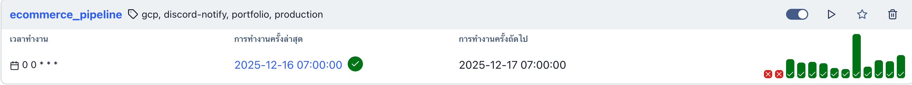
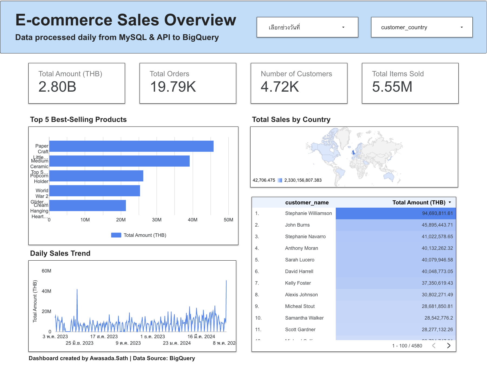
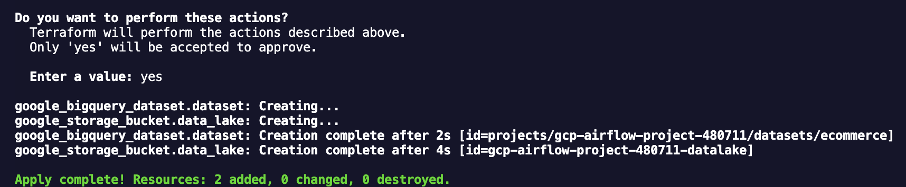

# 🛒 End-to-End Ecommerce Data Pipeline & Dashboard


## <a id="overview"></a>📖 Project Overview

This project is an **end-to-end data pipeline** designed to simulate a real-world E-commerce scenario.

**Why I built this?**

Most data engineering tutorials use clean, static CSV files. I wanted to build something that reflects the **messy reality of production environments**. I designed this pipeline to extract raw transactions from a MySQL database, enrich them with live exchange rates from an API, and automate the entire flow using Airflow and Docker.

Instead of just moving data, this project focuses on solving production-level problems like handling API failures, catching bad data, and monitoring the system via Discord.

### 🎯 Key Objectives
* **Automation:** Replaced manual scripts with a daily **Apache Airflow** DAG to keep data fresh automatically.
* **Data Enrichment:** Combined internal sales records with external currency APIs to calculate accurate revenue in THB.
* **Infrastructure as Code (IaC):** Used **Terraform** to provision GCP resources (GCS & BigQuery) so the environment is reproducible and standard-compliant.
* **Data Quality:** Implemented automated checks (e.g., removing negative values, deduplication) and real-time alerts via **Discord Webhooks**.

## 🏗️ Architecture

The following diagram illustrates the high-level architecture of the data pipeline, showcasing the flow from data ingestion to visualization.


### 🔄 Data Flow Summary
1.  **Ingestion:** Airflow extracts transaction data from **MySQL** and fetches daily exchange rates from the **Currency API**.
2.  **Transformation:** Data is processed using **Pandas** to merge datasets, convert currency (GBP to THB), and perform data cleaning (deduplication, handling nulls).
3.  **Staging:** The processed data is saved as Parquet files and uploaded to the **Google Cloud Storage (GCS)** bucket (Data Lake).
4.  **Loading:** Data is loaded from GCS into **Google BigQuery** (Data Warehouse) using the `WRITE_TRUNCATE` strategy for daily snapshots.
5.  **Visualization:** **Looker Studio** connects to BigQuery to generate interactive dashboards.
6.  **Monitoring:** The pipeline sends real-time status alerts (Success/Failure) and data quality warnings to **Discord**.

## 🛠️ Tech Stack & Tools

I chose this stack to practice **Cloud-Native** development. Every component runs in Docker containers to ensure it works the same way locally and in production.


| Category | Tool | Description & Usage |
| :--- | :--- | :--- |
| **Orchestration** | **Apache Airflow** | Schedules and monitors the daily ETL workflow. Runs inside Docker containers to ensure environment consistency. |
| **Language** | **Python** | Used for defining DAGs and writing the core transformation logic. **Pandas** is utilized for efficient in-memory data processing and cleaning. |
| **Infrastructure** | **Terraform** | Manages GCP resources (GCS buckets, BigQuery datasets) via code (IaC), ensuring the infrastructure is reproducible and version-controlled. |
| **Containerization** | **Docker** | Packages the Airflow environment, Postgres (metadata DB), and Redis (broker) into portable services using docker-compose. |
| **Data Lake** | **Google Cloud Storage (GCS)** | Acts as the staging area for processed Parquet files before loading them into the warehouse. |
| **Data Warehouse** | **Google BigQuery** | Serverless data warehouse used to store the final transactional data, enabling high-speed SQL queries for analytics. |
| **Visualization** | **Looker Studio** | Connects directly to BigQuery to visualize sales performance, exchange rate trends, and product metrics. |
| **Monitoring** | **Discord Webhook** | Specific Python callback functions trigger real-time alerts to a Discord channel for job successes, failures, and data quality warnings. |

## <a id="datasources"></a>📂 Data Sources & Simulation

To simulate a realistic enterprise environment, I utilized a **Data Seeding Script** to transform raw CSV data into a proper SQL database structure.

### 1. Data Origin & Preprocessing
* **Source:** [E-Commerce Business Transaction](https://www.kaggle.com/datasets/gabrielramos87/an-online-shop-business/data) on Kaggle.
* **Simulation Workflow:** Before ingestion, I processed the raw CSV using Pandas to make it look like real-time production data:
    1.  **Date Adjustment:** Shifted transaction dates to the **2023–2024** period to simulate recent activity.
    2.  **Normalization:** Split the flat dataset into three relational tables (`transaction`, `customer`, `product`) to practice SQL joins and schema design.
    3.  **Anonymization:** Generated fake names for customers to simulate PII protection.
    4.  **Ingestion:** Inserted the clean data into the MySQL container.

### 2. Simulated Database Schema (MySQL)
The Airflow pipeline extracts data from this normalized schema:


**Table 1: `transaction` (Fact Table)**
| Column | Type | Description |
| :--- | :--- | :--- |
| `TransactionNo` | TEXT | Unique transaction ID |
| `Date` | DATETIME | Timestamp of the transaction |
| `ProductNo` | TEXT | Foreign Key linking to the Product table |
| `CustomerNo` | DOUBLE | Foreign Key linking to the Customer table |
| `Price` | DOUBLE | Unit price in GBP (£) |
| `Quantity` | BIGINT | Number of units sold (Negative values indicate returns) |

**Table 2: `customer` (Dimension Table)**
| Column | Type | Description |
| :--- | :--- | :--- |
| `CustomerNo` | DOUBLE | Unique customer identifier |
| `Name` | TEXT | Anonymized customer name |
| `Country` | TEXT | Country of residence |

**Table 3: `product` (Dimension Table)**
| Column | Type | Description |
| :--- | :--- | :--- |
| `ProductNo` | TEXT | Unique product code |
| `ProductName` | TEXT | Description/Name of the product |


*(Image: Entity-Relationship Diagram showing the normalized 3-table structure)*
### 3. External Source: Currency Exchange API
To enrich the sales data with local currency values (THB), the pipeline integrates with an external API.

*(Image: Example JSON response from the Currency API, showing GBP to THB rate)*
* **Integration:** Fetches the daily `GBP` to `THB` exchange rate corresponding to the transaction date.
* **Resiliency:** Implements a **Fallback Mechanism** to use a default exchange rate if the API service is unavailable, ensuring pipeline reliability.

## <a id="etl"></a>⚙️ ETL Pipeline Workflow

I used **Apache Airflow** to manage task dependencies and scheduling. The DAG runs once a day to fetch new transactions and update the dashboard.

### 1. 🕹️ Orchestration & Dependency Management
The Airflow DAG (`ecommerce_pipeline`) manages the execution order. It ensures that data extraction from MySQL and API fetching happen in parallel before the transformation step begins.



*(Image: The Directed Acyclic Graph (DAG) visualizing task dependencies and execution flow)*

**Task Logic Breakdown:**
* **`start`**: A dummy operator marking the beginning of the pipeline execution.
* **`extract_mysql`**: Pulls raw transactional data from the internal database.
* **`extract_api`**: Hits the external API to get the current THB rate.
* **`transform_data`**: Merges data, cleans anomalies, and calculates revenue.
* **`upload_to_gcs`**: Uploads processed data to the staging area.
* **`load_to_bq`**: Materializes the final dataset in the data warehouse.
* **`notify_success`**: Sends a specific completion alert to Discord.

### 2. ✅ Execution Monitoring
The pipeline is designed to be idempotent. The Grid View below confirms successful daily runs without failures.


*(Image: Historical execution logs showing consistent successful runs)*

### 3. 📦 Staging Layer (Google Cloud Storage)
After transformation, data is converted into **Parquet format** and stored in a Data Lake (GCS). This serves as a backup and staging area before warehousing.


*(Image: Processed Parquet files stored in the GCS Staging Bucket)*

**Why Parquet?**
* **Compression:** Reduces storage costs and transfer time.
* **Schema Enforcement:** Preserves data types (e.g., DateTime, Float) better than CSV.

### 4. 🗄️ Data Warehouse (Google BigQuery)
Finally, the data is loaded into BigQuery using the `WRITE_TRUNCATE` strategy. The screenshot below verifies that the data including the calculated `thb_amount` is accurately populated.


*(Image: Final data resident in BigQuery, ready for analysis)*

### 💻 Key Implementation Details (Code Highlights)

To ensure maintainability and reliability, the DAG is implemented using **Airflow TaskFlow API (@task)** with modular design principles.

#### 1. Resilience: API Fallback Mechanism
To prevent pipeline failure during external API outages, I implemented a `try-except` block. If the API times out, the system automatically defaults to a safe static rate.

```python
# Snippet from extract_api_data task
try:
    r = requests.get(api_url, timeout=10)
    r.raise_for_status()
    # ... process JSON ...
except Exception as e:
    log.error(f"API Error: {e}. Using Fallback Data (45.0).")
    
    # Fallback to default exchange rate to keep pipeline running
    df = pd.DataFrame({
        'date': [datetime.now().strftime('%Y-%m-%d')], 
        'gbp_thb': [45.0]
    })
```
#### 2. Modular Design & Separation of Concerns
Instead of **overloading** the DAG file with complex logic, the transformation code is **extracted** into a separate script (`transform_logic.py`) and imported. This makes unit testing easier and keeps the DAG focused on orchestration.

```python
# Importing external logic to keep the DAG file clean and readable
from transform_logic import run_transform_and_clean

@task(task_id="transform_data")
def transform_data():
    log.info("Starting Transformation Logic from external script...")
    
    # Executing the external logic
    output_file_path = run_transform_and_clean(
        mysql_file=MYSQL_OUTPUT_FILE, 
        api_file=API_OUTPUT_FILE
    )
    return output_file_path
```

#### 3. Automated Error Handling
I utilized Airflow's on_failure_callback to trigger the Discord Webhook immediately upon any task failure, minimizing downtime.

```python
default_args = {
    'owner': 'awasada.sath',
    'on_failure_callback': notify_failure, # Triggers Discord Alert immediately
    'retries': 1, 
    'retry_delay': timedelta(minutes=1),
}
```
#### 3. Security & Configuration Management
To follow security best practices, I avoided hardcoding credentials. Instead, I utilized **Airflow Connections** for database access and **Airflow Variables** for API configurations. This decouples sensitive data from the codebase.

```python
from airflow.models import Variable
from airflow.hooks.base import BaseHook

@task(task_id="extract_securely")
def extract_data():
    # Fetching configuration securely at runtime
    api_key = Variable.get("currency_api_key")
    db_conn = BaseHook.get_connection("my_local_mysql")
    
    log.info(f"Connecting to {db_conn.host} securely...")
    # ... extraction logic ...
```
---

## <a id="dashboard"></a>📊 Dashboard & Business Insights

I connected **Looker Studio** directly to the **BigQuery** warehouse to visualize the final dataset. This demonstrates how raw logs are turned into business metrics.



### What the dashboard shows:
* **Total Revenue in THB:** Calculated by joining sales data with the daily exchange rate from the API.
* **Top Products:** Identifies best-selling items to help with inventory planning.
* **Sales Trends:** A time-series chart tracking daily revenue performance from March 2023 to May 2024.
* **Geographic Distribution:** Shows which countries have the highest customer density.

### 🎛️ Interactivity
The dashboard allows filtering by **Date Range** and **Customer Country**, enabling users to drill down into specific segments.

## <a id="dataquality"></a>🛡️ Data Quality & Monitoring

I implemented specific checks to ensure trust in the numbers before they reach the dashboard.

### 1. Validation Logic
Inside the transformation task, data passes through these gates:
* **No Negative Revenue:** Rows with `thb_amount < 0` are automatically removed.
* **Deduplication:** Duplicate transaction IDs are removed to avoid **double counting**.
* **Completeness:** `Date` fields must not be null.

### 2. Automated Alerting (Discord)
The pipeline counts how many "bad rows" were removed. If the count > 0, it triggers a **Discord Webhook** to alert me immediately. This allows for proactive fixes rather than waiting for business users to report errors.


*(Image: Automated alerts sent to Discord when data cleaning removes invalid rows or detects duplicates)*

**Alert Logic:**
* **Trigger:** If `removed_rows > 0` (e.g., negative amounts found) or if duplicates are detected.
* **Action:** Calls `send_discord_warning` to notify the Data Engineer with a specific message like *"⚠️ Cleaned Data: Removed 5 bad rows"*.

## ☁️ Infrastructure as Code (Terraform)

To ensure reproducible deployments and eliminate manual configuration errors ("ClickOps"), I provisioned the entire Google Cloud Platform (GCP) infrastructure using **Terraform**.

### 1. 🏗️ Infrastructure Definition
I defined the core resources in `main.tf`, which manages the lifecycle of the Data Lake (GCS) and Data Warehouse (BigQuery).

**Configuration (`main.tf`):**
```hcl
provider "google" {
  project = "gcp-airflow-project-480711"
  region  = "us-central1"
}

resource "google_storage_bucket" "data_lake" {
  name          = "gcp-airflow-project-480711-datalake"
  location      = "US"
  storage_class = "STANDARD"
  force_destroy = true
  uniform_bucket_level_access = true
}

resource "google_bigquery_dataset" "dataset" {
  dataset_id                 = "ecommerce"
  location                   = "US"
  delete_contents_on_destroy = true
}
```
**Key Resources Provisioned:**
* **Storage Bucket (`gcp-airflow-project-480711-datalake`):**
  * Configured with `STANDARD` storage class for frequent access.
  * Enforced `uniform_bucket_level_access` for better security management.
* **BigQuery Dataset (`ecommerce`):**
  * Acts as the centralized Data Warehouse for storing processed tables.
  * `delete_contents_on_destroy` is enabled to facilitate easy cleanup during the development phase.

### 2. 🚀 Provisioning Infrastructure
Running `terraform apply` initializes the state and builds the cloud environment automatically. The screenshot below confirms the successful creation of resources.


*(Figure 5: Terminal output confirming the successful creation of the bucket and dataset)*

### 3. ✅ Cloud Verification
Verification on the Google Cloud Console confirms that the resources exist and match the Terraform configuration.


*(Figure 6: Verified creation of the 'ecommerce' dataset and 'datalake' bucket in GCP Console)*

**Why Terraform?**
* **Consistency:** Eliminates environment drift between local testing and production.
* **Version Control:** Infrastructure changes are tracked via Git.
* **Speed:** Deploys complex dependencies in minutes rather than hours.

## <a id="challenges"></a>🧩 Key Challenges & Solutions

Building an automated pipeline comes with its own set of challenges. Here is how I solved the main ones:

### 1. Handling API Instability
**The Problem:** The currency exchange API occasionally timed out or returned 500 Error, which caused the entire Airflow DAG to fail.
**The Solution:** I added a `try-except` block with a **fallback mechanism**. If the API fails, the pipeline logs a warning and uses a safe default rate (e.g., 45.0 THB) instead of crashing. This ensures the daily report is always delivered.

### 2. Preventing Data Duplication
**The Problem:** When re-running the DAG for past dates (Backfilling), data in BigQuery was being duplicated.
**The Solution:** I enforced **Idempotency** at the loading stage. For this project, I used the `WRITE_TRUNCATE` strategy to ensure daily snapshots are clean. (For larger production tables, I would implement a `MERGE` / Upsert logic based on Transaction ID).

### 3. "It Works on My Machine"
**The Problem:** Dependency conflicts between local Python and the cloud environment.
**The Solution:** I containerized everything using **Docker** and used **Terraform** to ensure the GCP infrastructure matches the code requirements exactly.

## 📂 Repository Structure

The project is organized into modular components to separate orchestration, logic, and infrastructure code.

```text
.
├── dags/
│   ├── ecommerce_pipeline.py    # Main Airflow DAG definition
│   └──  transform_logic.py      # Core data cleaning & transformation functions
├── terraform/
│   ├── .terraform.lock.hcl
│   └── main.tf                  # Infrastructure as Code (GCP Resources)
│                 
├── tests/
│   └── test_transform.py    # Unit tests (pytest) for data logic
├── images/                      # Screenshots used in this README
├── docker-compose.yaml          # Docker configuration for Airflow environment
├── Dockerfile
├── .gitignore
├── requirements.txt             # Python dependencies
└── README.md                    # Project documentation

```
## 🚀 Quick Start

You can reproduce this entire pipeline locally in minutes using Docker and Terraform.

### Prerequisites
* [Docker Desktop](https://www.docker.com/products/docker-desktop) installed.
* [Terraform](https://developer.hashicorp.com/terraform/downloads) installed.
* A Google Cloud Platform (GCP) project with credentials key file (`google_credentials.json`).

### 1. Provision Cloud Infrastructure
First, use Terraform to create the required Storage Bucket and BigQuery Dataset.

```bash
cd terraform
terraform init
terraform apply
# Type 'yes' when prompted to confirm resource creation.
```

### 2. Start the Application
Spin up the Airflow environment and the simulated MySQL database using Docker Compose.
```bash
cd ..
docker-compose up -d --build
```

### 3. Run the Pipeline
Once the containers are healthy:

Open your browser to http://localhost:8080.

Login with credentials: airflow / airflow.

Locate the DAG ecommerce_pipeline and toggle the switch to ON.

## ⚙️ Configuration Setup
To run this pipeline, the following Airflow configurations are required:

### 🔐 Connections
| Connection ID | Conn Type | Description |
| :--- | :--- | :--- |
| `mysql_default` | MySQL | Connects to the simulated Transaction Database. |
| `google_cloud_default` | Google Cloud | Authenticates with GCP services (GCS & BigQuery). |

### 🔑 Variables
| Key | Value Description | Usage |
| :--- | :--- | :--- |
| `currency_api_url` | URL string | Endpoint for the external Currency Exchange API. |
| `discord_webhook` | URL string | Webhook URL for sending success/failure alerts to Discord. |

---
