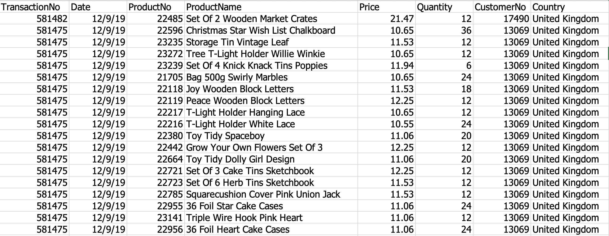
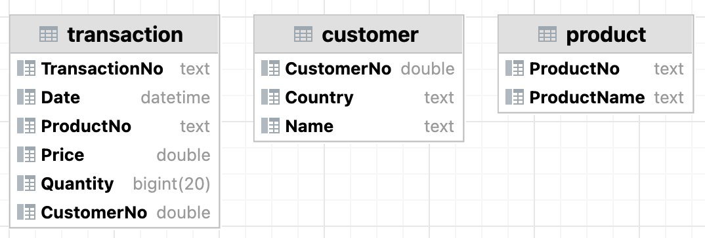
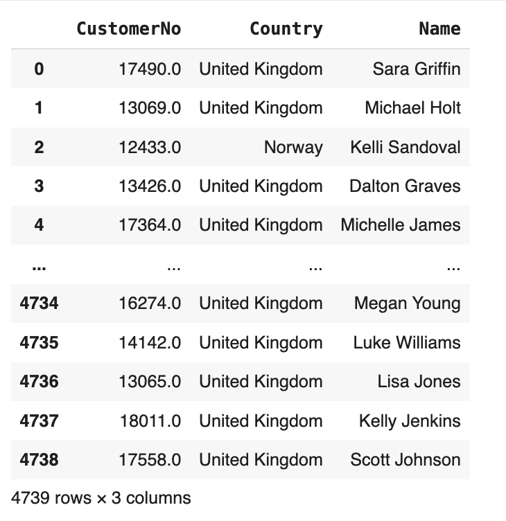
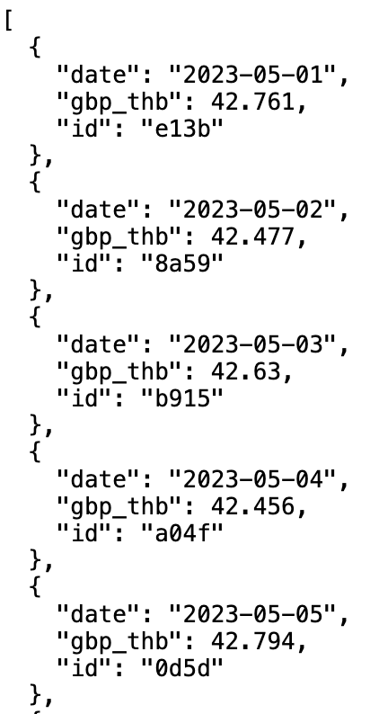
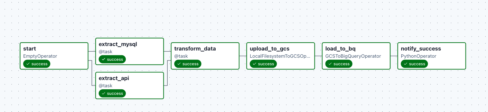
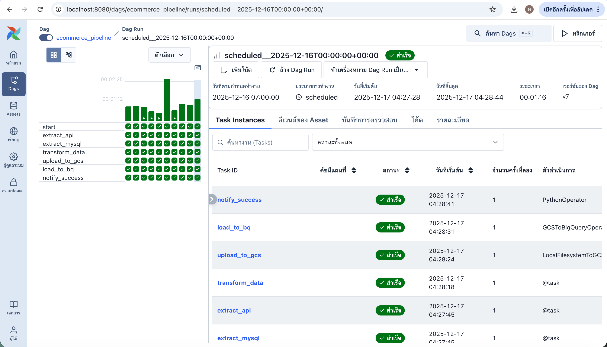
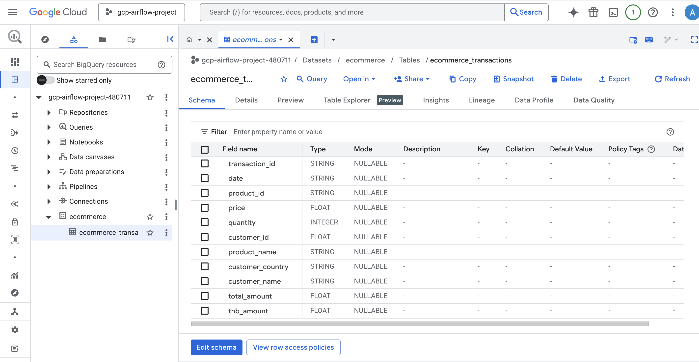
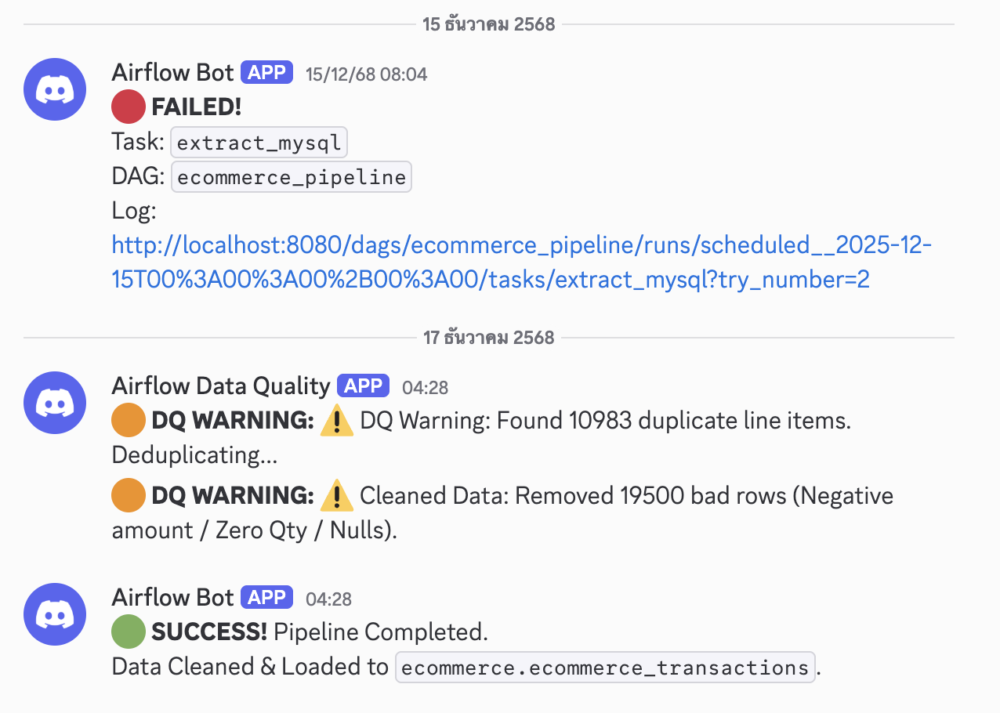

# 🛒 End-to-End Ecommerce Data Pipeline & Dashboard

## 📖 Project Overview

This project demonstrates a robust, end-to-end **Data Engineering solution** designed to simulate a real-world e-commerce scenario. The primary goal is to centralize fragmented transactional data, enrich it with external financial contexts, and automate the flow from raw data to actionable business insights.

In this pipeline, raw transaction records are extracted from an **OLTP Database (MySQL)** and enriched with dynamic exchange rates from an external **Currency API**. The data undergoes rigorous cleaning and transformation processes before being loaded into a **Data Warehouse (Google BigQuery)**. Finally, the processed data is visualized using **Looker Studio** to track key performance metrics (KPIs) such as daily revenue in local currency (THB) and product performance.

### 🎯 Key Objectives
* **Automation:** Orchestrate a daily ETL workflow using **Apache Airflow** to ensure data freshness without manual intervention.
* **Data Enrichment:** Integrate internal sales data with external exchange rate APIs to calculate accurate revenue figures in THB.
* **Infrastructure as Code (IaC):** Provision and manage Google Cloud Platform resources (GCS Buckets, BigQuery Datasets) using **Terraform** for reproducibility and standard compliance.
* **Data Quality & Reliability:** Implement data quality checks (e.g., handling negative values, deduplication) and real-time monitoring via **Discord Webhooks** to ensure pipeline stability.

## 🏗️ Architecture

The following diagram illustrates the high-level architecture of the data pipeline, showcasing the flow from data ingestion to visualization.

### 🔄 Data Flow Summary
1.  **Ingestion:** Airflow extracts transaction data from **MySQL** and fetches daily exchange rates from the **Currency API**.
2.  **Transformation:** Data is processed using **Pandas** to merge datasets, convert currency (GBP to THB), and perform data cleaning (deduplication, handling nulls).
3.  **Staging:** The processed data is saved as Parquet files and uploaded to the **Google Cloud Storage (GCS)** bucket (Data Lake).
4.  **Loading:** Data is loaded from GCS into **Google BigQuery** (Data Warehouse) using the `WRITE_TRUNCATE` strategy for daily snapshots.
5.  **Visualization:** **Looker Studio** connects to BigQuery to generate interactive dashboards.
6.  **Monitoring:** The pipeline sends real-time status alerts (Success/Failure) and data quality warnings to **Discord**.

## 🛠️ Tech Stack & Tools

The project leverages a modern data stack centered around containerization and cloud-native technologies.

| Category | Tool | Description & Usage |
| :--- | :--- | :--- |
| **Orchestration** | **Apache Airflow** | Schedules and monitors the daily ETL workflow. Runs inside Docker containers to ensure environment consistency. |
| **Language** | **Python** | Used for defining DAGs and writing the core transformation logic. **Pandas** is utilized for efficient in-memory data processing and cleaning. |
| **Infrastructure** | **Terraform** | Manages GCP resources (GCS buckets, BigQuery datasets) via code (IaC), ensuring the infrastructure is reproducible and version-controlled. |
| **Containerization** | **Docker** | Encapsulates the Airflow environment, Postgres (metadata DB), and Redis (broker) into portable services using `docker-compose`. |
| **Data Lake** | **Google Cloud Storage (GCS)** | Acts as the staging area for processed Parquet files before loading them into the warehouse. |
| **Data Warehouse** | **Google BigQuery** | Serverless data warehouse used to store the final transactional data, enabling high-speed SQL queries for analytics. |
| **Visualization** | **Looker Studio** | Connects directly to BigQuery to visualize sales performance, exchange rate trends, and product metrics. |
| **Monitoring** | **Discord Webhook** | specific Python callback functions trigger real-time alerts to a Discord channel for job successes, failures, and data quality warnings. |

## 📂 Data Sources & Simulation

To simulate a realistic enterprise environment, I utilized a **Data Seeding Script** to transform raw CSV data into a fully normalized SQL database structure, simulating an internal OLTP system.

### 1. Data Origin & Preprocessing Logic
* **Source:** [E-Commerce Business Transaction](https://www.kaggle.com/datasets/gabrielramos87/an-online-shop-business/data) on Kaggle.

*(Image: Snapshot of the raw CSV data showing denormalized records)*
* **Simulation Workflow:** The raw dataset undergoes a rigorous preprocessing pipeline using **Pandas** before being ingested into the database:
    1.  **Date Adjustment:** Transaction dates are shifted to simulate recent, real-time activity.
    2.  **Normalization:** The flat dataset is decomposed into three relational tables (`transaction`, `customer`, `product`) to reduce redundancy and demonstrate proper database design.
    3.  **Anonymization:** Customer names are generated using a faker library to simulate **PII (Personally Identifiable Information)** protection compliance.
    4.  **Ingestion:** The processed data is inserted into the **MySQL** container using `SQLAlchemy`.

### 2. Simulated Database Schema (MySQL)
The Airflow pipeline extracts data from this normalized schema:

**Table 1: `transaction` (Fact Table)**
| Column | Type | Description |
| :--- | :--- | :--- |
| `TransactionNo` | TEXT | Unique transaction ID (Starts with 'C' for cancellations) |
| `Date` | DATETIME | Timestamp of the transaction |
| `ProductNo` | TEXT | Foreign Key linking to the Product table |
| `CustomerNo` | DOUBLE | Foreign Key linking to the Customer table |
| `Price` | DOUBLE | Unit price in GBP (£) |
| `Quantity` | BIGINT | Number of units sold (Negative values indicate returns) |

**Table 2: `customer` (Dimension Table)**
| Column | Type | Description |
| :--- | :--- | :--- |
| `CustomerNo` | DOUBLE | Unique customer identifier |
| `Name` | TEXT | Anonymized customer name |
| `Country` | TEXT | Country of residence |

**Table 3: `product` (Dimension Table)**
| Column | Type | Description |
| :--- | :--- | :--- |
| `ProductNo` | TEXT | Unique product code |
| `ProductName` | TEXT | Description/Name of the product |

*(Image: Entity-Relationship Diagram showing the normalized 3-table structure)*
### 3. External Source: Currency Exchange API
To enrich the sales data with local currency values (THB), the pipeline integrates with an external API.

*(Image: Example JSON response from the Currency API, showing GBP to THB rate)*
* **Integration:** Fetches the daily `GBP` to `THB` exchange rate corresponding to the transaction date.
* **Resiliency:** Implements a **Fallback Mechanism** to use a default exchange rate if the API service is unavailable, ensuring pipeline reliability.

## ⚙️ ETL Pipeline Workflow

The entire data lifecycle is orchestrated by **Apache Airflow**, ensuring daily automation and reliability. Below is a visual walkthrough of the pipeline execution from start to finish.

### 1. 🕹️ Orchestration & Dependency Management
The Airflow DAG (`ecommerce_pipeline_v1`) manages the execution order. It ensures that data extraction from MySQL and API fetching happen in parallel before the transformation step begins.

*(Image: The Directed Acyclic Graph (DAG) visualizing task dependencies and execution flow)*

**Task Logic Breakdown:**
* **`extract_mysql_data`**: Pulls raw transactional data from the internal database.
* **`fetch_exchange_rate`**: Hits the external API to get the current THB rate.
* **`process_and_transform`**: Merges data, cleans anomalies, and calculates revenue.
* **`load_to_gcs`**: Uploads processed data to the staging area.
* **`load_to_bigquery`**: Materializes the final dataset in the data warehouse.

### 2. ✅ Execution Monitoring
The pipeline is designed to be idempotent. The Grid View below confirms successful daily runs without failures.

*(Image: Historical execution logs showing consistent successful runs)*

### 3. 📦 Staging Layer (Google Cloud Storage)
After transformation, data is converted into **Parquet format** and stored in a Data Lake (GCS). This serves as a backup and staging area before warehousing.

*(Image: Processed Parquet files stored in the GCS Staging Bucket)*

**Why Parquet?**
* **Compression:** Reduces storage costs and transfer time.
* **Schema Enforcement:** Preserves data types (e.g., DateTime, Float) better than CSV.

### 4. 🗄️ Data Warehouse (Google BigQuery)
Finally, the data is loaded into BigQuery using the `WRITE_TRUNCATE` strategy (or `WRITE_APPEND` for history). The screenshot below verifies that the data—including the calculated `TotalAmountTHB`—is accurately populated.

*(Image: Final data resident in BigQuery, ready for analysis)*

---

## 📊 Dashboard & Business Insights

The final stage of the pipeline is visualization. By connecting **Looker Studio** directly to the **BigQuery** data warehouse, raw transactional data is transformed into an interactive executive dashboard titled **"E-commerce Sales Overview"**.

This dashboard enables stakeholders to monitor near real-time performance in local currency (THB), utilizing data processed daily from the MySQL & API pipeline.

*(Figure 3: The final Looker Studio dashboard visualizing processed sales data)*

### 1. 🔑 Key Performance Indicators (KPIs)
The top section provides an immediate snapshot of the business's total cumulative performance:
* **Total Revenue:** **2.80B THB** (Calculated via dynamic exchange rates).
* **Total Orders:** **19.79K** transactions processed.
* **Customer Base:** **4.72K** unique customers served.
* **Volume:** **5.55M** total items sold.

### 2. 🏆 Product Performance Analysis
**"Top 5 Best-Selling Products"** (Bar Chart)
Identifies the highest revenue-generating items to inform inventory strategy.
* **Top Performer:** *Paper Craft Little Birdie* is the clear market leader.
* **Runners-up:** *Medium Ceramic Top Storage*, *Popcorn Holder*, and *World War 2 Gliders* follow closely.
* **Insight:** These 5 products drive a significant portion of total revenue, suggesting high demand for craft and novelty items.

### 3. 🌍 Geographic & Customer Segmentation
**"Total Sales by Country"** (Geo Map) & **Customer Table**
Visualizes the global footprint and identifies high-value clients.
* **Global Reach:** The map highlights sales distribution, with major activity centered in the UK and Europe (indicated by darker clusters).
* **Top Spenders:** The bottom-right table lists top customers by total spending (e.g., *David Harrell*, *Kelly Foster*), enabling targeted VIP marketing campaigns.

### 4. 📈 Temporal Trends
**"Daily Sales Trend"** (Time-Series Line Chart)
Tracks revenue fluctuations from **March 2023 to May 2024**.
* **Pattern:** The data shows periodic volatility with distinct spikes in sales activity.
* **Growth:** A notable upward trend is observed towards the end of the period (April–May 2024), indicating successful recent campaigns or seasonal demand.

### 🎛️ Interactivity
The dashboard includes dynamic filters at the top right:
* **Date Range Picker:** Allows analysis of specific timeframes.
* **Customer Country:** Enables drilling down into specific regional performance.

## 🛡️ Data Quality & Monitoring

To ensure data reliability, I implemented a strict **Data Quality Framework** that validates both the code logic and the actual data flowing through the pipeline.

### 🧪 1. Pre-Deployment: Unit Testing with `pytest`
Before deploying the DAG, the transformation logic is verified using **pytest**. I created a test suite (`test_data_cleaning_logic`) to mock dirty data scenarios and ensure the filters work correctly.

**Test Scenarios:**
* **Mock Data Injection:** Simulates raw data containing negative prices (`-50.0`) and invalid quantities (`0` or `-5`).
* **Logic Verification:** Asserts that the cleaning function correctly removes these anomalies while preserving valid records.

### 🔍 2. Runtime Validation (Inside Airflow Task)
During the execution of the `run_transform_and_clean` function, the data undergoes automated quality gates before being saved as a Parquet file:

* **Fallback Mechanism:** If the API fails to return a rate, the system automatically fills missing exchange rates with a default value (`45.0`) to prevent calculation errors.
* **Deduplication:** Checks for duplicate line items based on `transaction_id` and `product_id`. If found, it logs a warning and keeps only the first occurrence.
* **Business Rules Filter:**
    * **Positive Quantity:** Removes rows where `quantity <= 0`.
    * **Non-Negative Amount:** Removes rows where `thb_amount < 0`.
    * **Data Completeness:** Ensuring `date` fields are not null.

### 📸 3. Automated Alerting (Discord)
The pipeline calculates the number of "bad rows" removed. If data quality issues are detected, a warning is sent immediately to Discord.

*(Figure 4: Automated alerts sent to Discord when data cleaning removes invalid rows or detects duplicates)*

**Alert Logic:**
* **Trigger:** If `removed_rows > 0` (e.g., negative amounts found) or if duplicates are detected.
* **Action:** Calls `send_discord_warning` to notify the Data Engineer with a specific message like *"⚠️ Cleaned Data: Removed 5 bad rows"*.

